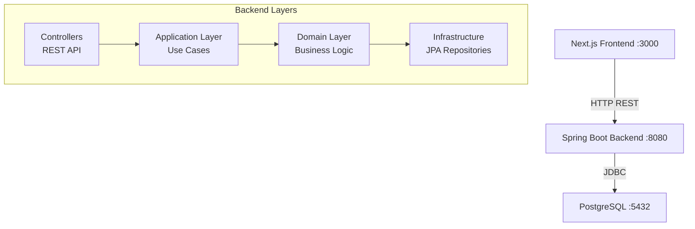

# 6. Documentation Strategy for Portfolio Project

Date: 2025-12-26

## Status

Accepted

## Context

We need to decide what documentation to create for the Issue Tracker portfolio project. The documentation should:

1. Help German recruiters/interviewers understand the project quickly
2. Demonstrate professional software engineering practices
3. Not take excessive time away from coding (time-boxed)
4. Follow modern standards (not outdated practices like extensive UML)

**Time Constraint**: Documentation should take ~10% of total development time (4-5 hours for 6-8 week project).

**Target Audience**:
- German hiring managers (non-technical)
- German software engineers (technical)
- Future contributors (ourselves, if we expand)

**Modern Context (2024)**:
- UML diagrams are declining in popularity (except large enterprises)
- Agile methodology favors "working software over comprehensive documentation"
- Code + tests + ADRs are often sufficient documentation
- Interactive API docs (Swagger) replaced static documentation
- German companies still value documentation more than US companies

## Decision

We will implement a **lightweight, high-value documentation strategy** with three tiers:

### Tier 1: Must Have (Required for Portfolio)

These provide 80% of documentation value with 20% of effort:

#### 1. README.md (Root of Backend Repository)
**Time**: 1-2 hours total (write incrementally)

**Sections**:
```markdown
# Issue Tracker Backend

## Overview
Public Infrastructure Issue Reporting System - Spring Boot backend with Hexagonal Architecture.

## Tech Stack
- Java 17
- Spring Boot 4.0
- PostgreSQL 15
- JWT Authentication
- Lombok
- Maven

## Architecture
Hexagonal Architecture (Ports & Adapters) - see [ADR 0001](docs/adr/0001-use-hexagonal-architecture.md)

## Prerequisites
- Java 17 or higher
- Docker & Docker Compose
- Maven 3.8+

## Quick Start

### 1. Start PostgreSQL Database
```bash
docker-compose up -d
```

### 2. Run Application
```bash
./mvnw spring-boot:run
```

### 3. Access Application
- API Base URL: http://localhost:8080
- API Documentation: http://localhost:8080/swagger-ui.html
- Health Check: http://localhost:8080/actuator/health

## Project Structure
```
src/main/java/com/issuetracker/
├── domain/              # Core business logic (framework-independent)
├── application/         # Use cases and DTOs
└── infrastructure/      # Spring Boot, JPA, REST controllers
```

## Environment Variables
```bash
# Optional - defaults provided for development
export JWT_SECRET="your-secret-key"
```

## API Endpoints
See interactive documentation at: http://localhost:8080/swagger-ui.html

Main endpoints:
- POST /api/auth/register - User registration
- POST /api/auth/login - User login (returns JWT)
- GET /api/issues - List all issues (paginated)
- POST /api/issues - Create new issue

## Testing
```bash
# Run all tests
./mvnw test

# Run with coverage
./mvnw test jacoco:report
```

## Documentation
- [Architecture Decision Records](docs/adr/) - Why we made technical decisions
- [Database Schema](docs/database-schema.md) - Complete database design
- [Requirements](docs/requirements.md) - Project requirements and features

## License
MIT
```

**Why**: First thing recruiters see on GitHub. Answers "What is this?" and "How do I run it?"

---

#### 2. API Documentation (Swagger/OpenAPI)
**Time**: 30 minutes setup + ongoing maintenance

**Implementation**:
Add to `pom.xml`:
```xml
<dependency>
    <groupId>org.springdoc</groupId>
    <artifactId>springdoc-openapi-starter-webmvc-ui</artifactId>
    <version>2.3.0</version>
</dependency>
```

Annotate controllers:
```java
@RestController
@RequestMapping("/api/issues")
@Tag(name = "Issues", description = "Issue management APIs")
public class IssueController {

    @Operation(
        summary = "Create new issue",
        description = "Creates a new infrastructure issue. Requires CITIZEN role."
    )
    @ApiResponses(value = {
        @ApiResponse(responseCode = "201", description = "Issue created successfully"),
        @ApiResponse(responseCode = "400", description = "Invalid input"),
        @ApiResponse(responseCode = "401", description = "Unauthorized")
    })
    @PostMapping
    public ResponseEntity<IssueResponse> createIssue(@RequestBody CreateIssueRequest request) {
        // Implementation
    }
}
```

**Result**: Auto-generated interactive API documentation at `/swagger-ui.html`

**Why**:
- German companies expect this
- Frontend developers (you!) can test APIs easily
- Replaces manual API documentation
- Shows professionalism

---

#### 3. Architecture Decision Records (ADRs)
**Time**: Already completed! ✅

**Status**: We have:
- ADR 0001: Hexagonal Architecture
- ADR 0002: PostgreSQL over MongoDB
- ADR 0003: JWT Authentication
- ADR 0004: Next.js App Router
- ADR 0005: TanStack Query
- ADR 0006: Documentation Strategy (this document)

**Maintenance**: Add new ADR when making major architectural decision (e.g., "Why we added caching", "Why we chose Docker for deployment")

**Why**:
- Shows systematic thinking
- Demonstrates understanding of trade-offs
- Very impressive for German interviewers (most candidates don't have ADRs)

---

#### 4. Database Schema Documentation
**Time**: Already completed! ✅

**Status**: We have `docs/database-schema.md` with:
- Complete SQL schema
- Indexes and performance optimizations
- Foreign key strategies
- Soft delete implementation
- Migration scripts

**Why**: Critical for understanding data model

---

#### 5. Code Comments (As You Code)
**Time**: Ongoing, ~5% of coding time

**Guidelines**:
```java
// ✅ GOOD: Explain WHY (not obvious from code)
// We use RESTRICT instead of CASCADE because citizens might want
// to view their issue history even after deletion request
citizen_id BIGINT NOT NULL REFERENCES users(id) ON DELETE RESTRICT

// ❌ BAD: Explain WHAT (obvious from code)
// Get user by ID
User user = userRepository.findById(id);

// ✅ GOOD: Explain complex business logic
// Issue can only be assigned if:
// 1. Status is PENDING or IN_PROGRESS (not CLOSED)
// 2. Assigned user has STAFF role
// 3. Staff member has capacity (<10 active issues)
if (issue.isClosed() || !user.isStaff() || user.getActiveIssueCount() >= 10) {
    throw new AssignmentException("Cannot assign issue");
}

// ✅ GOOD: JavaDoc on public APIs
/**
 * Creates a new issue in the system.
 *
 * @param command issue details (title, description, category, location)
 * @return created issue with generated ID and PENDING status
 * @throws ValidationException if title < 5 chars or description < 20 chars
 * @throws UserNotFoundException if citizen ID doesn't exist
 */
public Issue createIssue(CreateIssueCommand command) {
    // Implementation
}
```

**When to comment**:
- Complex business rules
- Non-obvious design decisions
- Public API methods (JavaDoc)
- Security-critical code

**When NOT to comment**:
- Self-explanatory code
- Simple getters/setters
- Test methods (test name should be clear)

---

### Tier 2: Should Have (Add After MVP Works)

High value, moderate effort:

#### 6. Simple Architecture Diagram
**Time**: 30-60 minutes

**Tool**: draw.io, Excalidraw, or Mermaid.js

**What to Show**:
- Frontend (Next.js)
- Backend (Spring Boot with 3 layers: Domain, Application, Infrastructure)
- Database (PostgreSQL)
- Communication protocols (HTTP REST, JDBC)

**Where**: Include in README.md or `docs/architecture.md`

**Example (Mermaid.js - text-based)**:
```markdown
## Architecture


```

**Why**: Visual learners (interviewers) understand faster than text

---

#### 7. Database ER Diagram
**Time**: 15-30 minutes

**Tool**: dbdiagram.io (generates from SQL), draw.io, or Mermaid.js

**What to Show**:
- Tables: Users, Issues, Timeline
- Primary keys
- Foreign keys with relationships
- Key indexes

**Where**: `docs/database-schema.md` (append to existing doc)

**Why**: Visual representation easier to understand than SQL

---

#### 8. Authentication Sequence Diagram
**Time**: 20-30 minutes

**Tool**: Mermaid.js (can embed in Markdown)

**What to Show**:
- User login flow
- JWT generation
- Token storage
- Protected endpoint access with JWT

**Where**: `docs/authentication-flow.md` or in ADR 0003

**Why**: Common interview question: "Explain how your authentication works"

---

### Tier 3: Nice to Have (Only If Time Permits)

Low priority, only after project is fully functional:

#### 9. Screenshots in README
**Time**: 30 minutes

**What**: Screenshots of:
- Admin dashboard
- Issue creation form
- Swagger UI

**Why**: Makes README more engaging

---

#### 10. Postman Collection
**Time**: 15 minutes

**What**: Export Postman collection of all API endpoints with example requests

**Why**: Easy for others to test API (but Swagger already provides this)

---

#### 11. Deployment Guide
**Time**: 30-60 minutes

**What**: How to deploy to production (AWS, Railway, etc.)

**Why**: Shows DevOps knowledge

---

### What We DON'T Do

#### ❌ Skip These (Outdated/Low Value):

1. **Formal UML Class Diagrams**
   - IntelliJ can generate these automatically
   - Code is better documentation
   - Time-consuming to maintain

2. **UML Use Case Diagrams**
   - Swagger/OpenAPI replaced this
   - User stories in requirements.md are clearer

3. **UML Activity Diagrams**
   - Code + tests are clearer
   - Hard to keep in sync with code

4. **UML State Diagrams**
   - Only useful for very complex state machines
   - Our issue status transitions are simple enough to explain in code

5. **Extensive Word/PDF Documentation**
   - No one reads PDFs
   - Markdown in Git is better (version controlled, searchable)

6. **Design Documents Before Coding**
   - We use Agile approach: design emerges from code
   - ADRs capture decisions as we make them

---

## Documentation Timeline

### Sprint 1 (Week 1):
- ✅ ADRs written (already done)
- ✅ database-schema.md written (already done)
- [ ] Start README.md (basic structure)
- [ ] Add Swagger/OpenAPI dependency

### Sprint 2-3 (Week 2-3):
- [ ] Update README with API endpoints
- [ ] Add JavaDoc to public APIs
- [ ] Annotate controllers for Swagger

### Sprint 4 (Week 4):
- [ ] Complete README (setup instructions, screenshots)
- [ ] Create architecture diagram
- [ ] Create database ER diagram

### Sprint 5 (Week 5):
- [ ] Polish all documentation
- [ ] Add authentication sequence diagram
- [ ] Review and update ADRs if needed

### Sprint 6 (Week 6):
- [ ] Final documentation review
- [ ] Add screenshots to README
- [ ] Ensure all links work

---

## Tools We Use

| Documentation Type | Tool | Cost |
|-------------------|------|------|
| README, ADRs | Markdown | Free |
| API Documentation | SpringDoc OpenAPI | Free |
| Architecture Diagrams | Mermaid.js, draw.io, Excalidraw | Free |
| Database ER Diagrams | dbdiagram.io, Mermaid.js | Free |
| Sequence Diagrams | Mermaid.js, PlantUML | Free |
| Code Comments | JavaDoc | Built-in |

**All tools are FREE** - no paid licenses needed.

---

## Consequences

### Positive ✅

1. **Time-Efficient**
   - ~4-5 hours total documentation (10% of 40-50 hour project)
   - Focus on high-value documentation
   - Automated where possible (Swagger)

2. **Modern Approach**
   - Follows Agile principles (working software over documentation)
   - Uses modern tools (Swagger, Mermaid.js)
   - No outdated UML diagrams

3. **German Market Appeal**
   - More documentation than typical portfolio projects
   - ADRs show professional thinking
   - Swagger shows API professionalism
   - Balances "enough documentation" with "not over-documenting"

4. **Maintainable**
   - Markdown in Git (version controlled)
   - Swagger auto-updates with code
   - Simple diagrams easy to update

5. **Interview Ready**
   - Can walk through architecture diagram
   - Can show Swagger UI in live demo
   - Can reference ADRs when explaining decisions

### Negative ❌

1. **Not Comprehensive**
   - No formal UML diagrams (some old-school companies might expect)
   - No detailed design documents (but we have ADRs)
   - **Mitigation**: For interviews, we can generate UML from code if needed

2. **Requires Discipline**
   - Must update README as project evolves
   - Must write ADRs when making decisions (not after)
   - Must add JavaDoc as we code (not at the end)
   - **Mitigation**: Make it part of Sprint tasks

3. **English Only**
   - All documentation in English, not German
   - **Mitigation**: Acceptable in German tech industry (English is standard)

### Neutral 🔄

1. **Trade-off**: Documentation vs. Coding Time
   - We chose 90% coding, 10% documentation
   - Some projects do 50/50 (too much for portfolio)
   - Some projects do 95/5 (too little for professional impression)

---

## Success Criteria

Documentation is successful if:

1. **Recruiter Test** (Non-Technical)
   - Can they understand what the project does? (README)
   - Can they see it's professional? (ADRs, Swagger)

2. **Engineer Test** (Technical)
   - Can they understand architecture? (Diagram, ADRs)
   - Can they run the project? (README setup instructions)
   - Can they test the API? (Swagger)

3. **Interview Test**
   - Can you explain technical decisions? (ADRs)
   - Can you show working API? (Swagger)
   - Can you explain architecture? (Diagram)

4. **Maintenance Test**
   - Can you update documentation in <15 minutes? (Yes)
   - Is documentation version-controlled? (Yes, in Git)

---

## Review Schedule

- **After Sprint 1**: Check if README is clear
- **After Sprint 3**: Check if Swagger is complete
- **After Sprint 5**: Full documentation review
- **Before Job Applications**: Final polish

---

## References

- [Agile Manifesto](https://agilemanifesto.org/) - "Working software over comprehensive documentation"
- [C4 Model for Software Architecture](https://c4model.com/) - Modern alternative to UML
- [SpringDoc OpenAPI](https://springdoc.org/) - Swagger for Spring Boot
- [Architecture Decision Records (ADRs)](https://adr.github.io/) - Lightweight architecture documentation
- [Markdown Guide](https://www.markdownguide.org/) - Writing good README files

---

## Decision Owner

This decision can be revised if:
- Time constraints change (more/less time available)
- German company feedback suggests more/less documentation needed
- New tools make documentation easier

**Next Review**: After Sprint 3 (reassess if documentation strategy is working)
